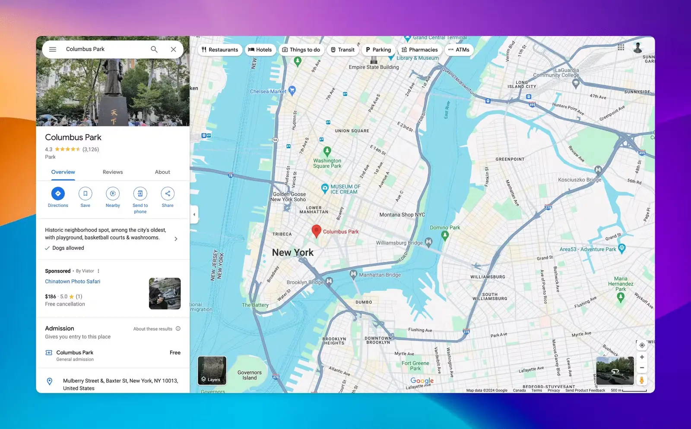

<div align="center">



# 🎨 tsarr.in

**Make Your Screenshots Absolutely Beautiful**

[](https://tsarr.in)
[](LICENSE)
[](https://nextjs.org)
[](https://www.typescriptlang.org)

[🚀 Live Demo](https://tsarr.in) • [📸 Screenshot Editor](https://tsarr.in/editor) • [💻 Code Screenshots](https://tsarr.in/code) • [🛠️ All Tools](https://tsarr.in/tools)

</div>

---

## ✨ What is tsarr.in?

**tsarr.in** is a powerful, completely free online creative toolkit that transforms ordinary screenshots into stunning visual content. With 18+ professional-grade tools and zero login requirements, it's perfect for developers, designers, content creators, and anyone who wants to create beautiful visuals instantly.

### 🎯 Key Highlights

- **🆓 100% Free Forever** - No premium features, no paywalls, no limitations
- **🔓 No Login Required** - Start creating immediately
- **🚀 18+ Creative Tools** - Everything from screenshot editing to video captions
- **♾️ Unlimited Exports** - Export as many times as you want
- **📱 Works Everywhere** - Browser-based, works on any device

---

## 🛠️ Featured Tools

### 📸 Screenshot Editor
Transform boring screenshots into professional visuals with:
- **Multiple Frame Styles** - macOS, Windows, and browser frames
- **Beautiful Backgrounds** - Gradients, solid colors, or custom images
- **Transform Controls** - Tilt, rotate, and position with precision
- **Annotations** - Arrows, shapes, text, blur, and highlights
- **Multiple Export Formats** - PNG, SVG, JPEG, WebP (up to 4x resolution)

### 💻 Code Editor
Create beautiful code screenshots with:
- **Syntax Highlighting** - Support for all major programming languages
- **20+ Themes** - Popular themes like Dracula, Monokai, GitHub, and more
- **Customizable Frames** - Match your preferred IDE style
- **One-Click Export** - Share your code snippets beautifully

### 🎭 Other Creative Tools

| Tool | Description |
|------|-------------|
| 🖼️ **Text Behind Image** | Create stunning text behind image effects with AI background removal |
| 🎬 **Video Captions** | Add stylish captions and subtitles with auto-transcription |
| 🐦 **Tweet Editor** | Design beautiful tweet screenshots |
| 📱 **Carousel Maker** | Create engaging carousel posts |
| 📐 **Aspect Ratio** | Adjust images to any aspect ratio |
| 🔄 **Image Resizer** | Resize images while maintaining quality |
| 🔀 **Image Converter** | Convert between PNG, JPG, WebP, and more |
| 📋 **Clipboard Saver** | Save clipboard content instantly |
| 🎥 **Video Converter** | Convert video formats easily |
| 📊 **Chart Maker** | Create beautiful data visualizations |
| 🗺️ **Map Maker** | Generate custom maps |
| 🌍 **3D Globe** | Interactive 3D globe creator |
| 📷 **Polaroid Generator** | Give images a classic Polaroid look |
| ✨ **Watermark Remover** | Remove unwanted watermarks |

---

## 🚀 Getting Started

### Prerequisites

- Node.js 16.x or higher
- npm, yarn, or pnpm

### Installation

1. Clone the repository:
```bash
git clone https://github.com/tansihmittal/tsarr.git
cd tsarr
```

2. Install dependencies:
```bash
npm install
# or
yarn install
# or
pnpm install
```

3. Set up environment variables:
```bash
cp .env.example .env.local
```

4. Run the development server:
```bash
npm run dev
# or
yarn dev
# or
pnpm dev
```

5. Open [http://localhost:3000](http://localhost:3000) in your browser

---

## 🏗️ Tech Stack

- **Framework** - [Next.js 14](https://nextjs.org) with TypeScript
- **Styling** - [Tailwind CSS](https://tailwindcss.com)
- **Deployment** - [Vercel](https://vercel.com)
- **Backend** - Firebase (Configuration included)
- **Testing** - Vitest

---

## 📂 Project Structure
```
tsarr/
├── components/      # React components
├── context/         # React context providers
├── data/           # Static data and configurations
├── hooks/          # Custom React hooks
├── pages/          # Next.js pages and API routes
├── public/         # Static assets
│   └── images/     # Image assets
├── styles/         # Global styles
├── utils/          # Utility functions
└── firebase.config.ts  # Firebase configuration
```

---

## 🎨 Use Cases

Perfect for:
- 📚 **Documentation** - Create clear, beautiful screenshots for docs
- 📱 **Social Media** - Design eye-catching posts and stories
- 💼 **Presentations** - Professional visuals for slides
- 🎓 **Teaching** - Visual learning materials and tutorials
- 🐛 **Bug Reports** - Annotated screenshots for clear communication
- 🎨 **Portfolio** - Showcase your work beautifully
- 📊 **Marketing** - Create engaging visual content

---

## 🌟 Why Choose tsarr.in?

| Feature | tsarr.in | Others |
|---------|----------|--------|
| Price | ✅ Free Forever | ❌ Paid/Freemium |
| Login Required | ✅ No | ❌ Yes |
| Export Limit | ✅ Unlimited | ❌ Limited |
| Tools Count | ✅ 18+ | ❌ 1-5 |
| Watermarks | ✅ None | ❌ Yes |
| Privacy | ✅ No Upload to Server | ❌ Server Processing |

---

## 🤝 Contributing

Contributions are welcome! Here's how you can help:

1. Fork the repository
2. Create a feature branch (`git checkout -b feature/AmazingFeature`)
3. Commit your changes (`git commit -m 'Add some AmazingFeature'`)
4. Push to the branch (`git push origin feature/AmazingFeature`)
5. Open a Pull Request

---

## 📝 License

This project is licensed under the MIT License - see the [LICENSE](LICENSE) file for details.

---

## 👨‍💻 Author

**Tanish Mittal**

- Website: [tanishmittal.com](https://tanishmittal.com)
- GitHub: [@tansihmittal](https://github.com/tansihmittal)
- Twitter: [@mittaltani36318](https://x.com/mittaltani36318)
- LinkedIn: [tanishmittal02](https://www.linkedin.com/in/tanishmittal02/)
- Instagram: [@tanishmittal02](https://www.instagram.com/tanishmittal02)
- YouTube: [@tanishmittal](https://www.youtube.com/@tanishmittal)
- Email: [me@tanishmittal.com](mailto:me@tanishmittal.com)

---

## 💖 Support

If you find tsarr.in useful, please consider:
- ⭐ Starring the repository
- 🐦 Sharing it on social media
- 🐛 Reporting bugs or suggesting features
- 💬 Spreading the word to friends and colleagues

---

## 📊 Stats

<div align="center">


</div>

---

<div align="center">

**[🚀 Start Creating Now](https://tsarr.in/editor)**

Made with ❤️ by [Tanish Mittal](https://tanishmittal.com)

© 2025 tsarr.in • Free Online Creative Tools • All rights reserved

</div>
